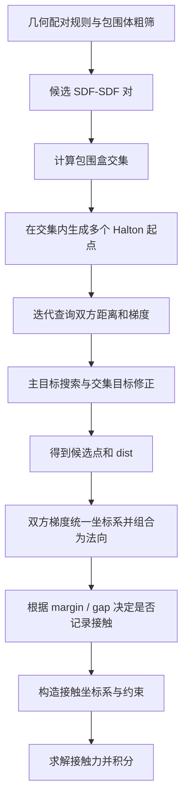

# 稠密 SDF–SDF 如何判断碰撞与计算接触法向

本文依据 2026-09-29 当前工作区的 MuJoCo Warp 实现，说明两个碰撞几何均使用稠密 SDF 时的处理过程。具体对应 PiPER 的 **SDF 手指与 SDF 方块**，采用 `resolution=257`、`gradient_mode="cell"`。这里描述的是本仓库实现，不能直接推广为所有 MuJoCo 后端的算法。

## 1. 核心思路

每个几何拥有自己的局部距离场。在一个空间位置分别查询双方的有符号距离，可以判断这个位置是否同时位于双方内部；通过多起点迭代搜索，找到可能发生接触的位置。随后查询双方梯度，组合成接触法向，交给约束求解器计算接触力。

稠密缓存接管的是 **距离和梯度查询**。候选碰撞对筛选、接触点搜索、最终法向构造和约束求解仍由 MuJoCo Warp 完成。

这条路径不会逐一比较两个网格的全部三角形，也不会每步遍历整个稠密体素数组；它只在接触搜索需要的位置读取附近的数据。



## 2. 距离场和梯度分别表示什么

设某个几何的局部有符号距离函数为 \(\phi(p)\)：

- \(\phi(p)>0\)：位于几何外部。
- \(\phi(p)=0\)：位于表面。
- \(\phi(p)<0\)：位于几何内部。

局部梯度为：

\[
g(p)=\nabla\phi(p).
\]

在光滑且梯度非零的位置，梯度指向距离值增大的方向，即几何外侧；其归一化方向可作为该几何的表面法向。

本实现使用采样和插值后的距离场。梯度的长度不保证处处为 1，棱边和单元边界附近也可能不光滑。因此：

- **接触点搜索使用未归一化梯度**，保留其作为距离函数导数的尺度。
- **最终接触法向计算时再归一化**。

## 3. 稠密缓存如何构建和查询

### 3.1 构建阶段

当前缓存由 MuJoCo 编译后的原生网格八叉树采样得到。手指和方块沿用原网格，方块没有改成解析 box SDF。

每个网格在其编译后的局部坐标系中，覆盖八叉树根节点包围盒，建立一个规则的 \(257\times257\times257\) 格点数组。各轴间距可以不同。

缓存包含：

| 数据 | 当前保存内容 | 用途 |
| --- | --- | --- |
| 格点数据 | 每格点 4 个 float32：距离、梯度 x/y/z | 距离插值；可选的格点梯度插值 |
| 单元梯度数据 | 每单元 12 个 float32，打包为 4 个 vec3 | `cell` 模式计算距离插值函数的梯度 |
| 索引元数据 | 数组偏移、维度、局部下界、各轴间距倒数 | 将局部坐标直接映射为数组索引 |

`cell` 模式保留上述两组数据，但体积内部的运行时梯度使用单元梯度系数。缓存随刚体一起使用局部坐标，无需因刚体移动而重建；相同几何的多个环境共享缓存。

### 3.2 距离查询：八角点三线性插值

设局部查询点为 \(p\)，网格下界为 \(l\)，各轴间距为 \(h\)，先计算格点坐标：

\[
u=(p-l)\oslash h.
\]

其中 \(\oslash\) 表示逐分量相除。对每个轴，将坐标限制到有效范围，选择一个单元和单元内坐标 \((t_x,t_y,t_z)\)。上边界使用最后一个单元，单元内坐标取 1，避免访问越界。

设该单元八个角点的距离为 \(d_{abc}\)，其中 \(a,b,c\in\{0,1\}\)，则：

\[
\phi(p)=\sum_{a,b,c\in\{0,1\}}
  w_a(t_x)w_b(t_y)w_c(t_z)d_{abc},
\qquad w_0(t)=1-t,\quad w_1(t)=t.
\]

数组展开索引为：

\[
\operatorname{index}(i,j,k)=\operatorname{offset}+(iN_y+j)N_z+k.
\]

因此定位数据只需要坐标运算和数组索引，体积内部没有八叉树逐层查找。

### 3.3 梯度查询：预存单元内的导数系数

单元内的三线性距离函数也可以写成：

\[
\phi(t_x,t_y,t_z)=c_0+c_xt_x+c_yt_y+c_zt_z
+c_{xy}t_xt_y+c_{xz}t_xt_z+c_{yz}t_yt_z+c_{xyz}t_xt_yt_z.
\]

它对**物理坐标**的导数为：

\[
g_x=\frac{c_x+c_{xy}t_y+c_{xz}t_z+c_{xyz}t_yt_z}{h_x},
\]

\[
g_y=\frac{c_y+c_{xy}t_x+c_{yz}t_z+c_{xyz}t_xt_z}{h_y},
\]

\[
g_z=\frac{c_z+c_{xz}t_x+c_{yz}t_y+c_{xyz}t_xt_y}{h_z}.
\]

构建缓存时，由该单元八角点的距离预先算出这些系数，并乘上相应的间距倒数。运行时读取 4 个 vec3，再进行少量乘加即可得到梯度。

这样计算的梯度，在单元内部与**稠密三线性距离插值**的导数一致，只有浮点计算误差；这并不表示它在所有位置都与原八叉树梯度完全相同。

可选的 `vertex` 模式直接插值八角点预存的梯度。它可能跨边界混合不连续的梯度，且不保证等于距离插值函数的导数；本文所述的 `cell` 模式避免了这类独立插值误差。

### 3.4 查询点超出缓存包围盒时

当前实现保留原生体积查询的延拓方式：

1. 计算查询点到包围盒的外部距离 \(d_{box}\)。
2. 将越界分量投影到包围盒内侧，保留代码中的 \(10^{-4}\) m 内缩偏移，得到 \(p'\)。
3. 返回 \(d_{box}+\phi(p')\)。

包围盒外的梯度仍用步长 \(\epsilon=10^{-4}\) m 的前向差分计算：

\[
g_x\approx\frac{\phi(p+\epsilon e_x)-\phi(p)}{\epsilon},
\]

另外两轴同理。这需要一次基准距离查询和三次偏移距离查询；其距离查询仍可走稠密缓存。因此“缓存梯度后每次都只读取梯度系数”只适用于体积内部。

## 4. 从粗筛到接触搜索起点

### 4.1 粗筛保留候选碰撞对

`collision()` 先执行配置指定的粗筛。本例评测使用 NXN 路径：模型预先依据 `contype`、`conaffinity`、刚体关系和显式排除规则筛选配对，运行时再进行启用的包围体检查。

这一步使用几何的包围信息，尚未执行稠密 SDF 查询。候选对必须继续进入精细碰撞，才能生成实际接触。

### 4.2 精细碰撞进一步计算包围盒交集

`_sdf_narrowphase()` 将几何 2 的局部包围盒变换到几何 1 的坐标系，再取轴对齐包围盒交集。

如果任意轴上的交集为空，该对直接返回。即使粗筛因候选间隙保留了它，当前 SDF 路径也不会继续搜索。因此不能理解为“设置正 margin 后，任意分离的 SDF 对都一定生成接触”。

交集存在也只能说明有搜索区域，并不证明两个实际几何已经相交。

### 4.3 使用多个 Halton 起点

在交集包围盒内，三个轴分别使用底数 2、3、5 的 Halton 序列生成起点，再将起点转换到几何 2 的局部坐标系。

当前默认 `sdf_initpoints=40`，即每个候选对启动 40 条搜索路径。内核启动维度为 `(sdf_initpoints, naconmax)`，无效候选槽位会提前返回；不同环境的候选对携带各自的 `worldid`。

这些起点覆盖的是包围盒交集，起点本身未必位于任一物体内部。每条搜索都可能产生一个接触候选，不能将 40 个起点理解为固定产生 40 个有效接触。

## 5. 两个距离场如何共同搜索接触点

### 5.1 在同一个物理位置查询双方距离

设两个几何的世界位姿分别为 \((R_1,t_1)\)、\((R_2,t_2)\)，旋转矩阵把局部坐标变换到世界坐标。

算法在几何 2 的局部坐标中优化点 \(x\)。同一物理位置在几何 1 中的坐标为：

\[
x_1=Qx+b,\qquad Q=R_1^TR_2,\qquad b=R_1^T(t_2-t_1).
\]

于是双方距离为：

\[
A(x)=\phi_1(Qx+b),\qquad B(x)=\phi_2(x).
\]

这里使用的是编译后碰撞几何的坐标系与位姿，不能简单用机械臂 link 的原点代替。

### 5.2 主搜索目标

`clearance(..., sfd_intersection=False)` 定义：

\[
F(x)=A(x)+B(x)+|\max(A(x),B(x))|.
\]

算法默认执行 `sdf_iterations=10` 轮梯度下降。几何 1 的局部梯度先通过链式法则变换为几何 2 坐标系中的梯度：

\[
a=Q^T\nabla\phi_1(x_1),\qquad b_g=\nabla\phi_2(x).
\]

随后计算：

\[
\nabla F=a+b_g+\operatorname{sign}(\max(A,B))\,g_{max},
\]

其中，若 \(A>B\)，则 \(g_{max}=a\)；否则取 \(b_g\)。相等位置按代码的后一分支处理。

每轮使用回溯线搜索：初始 `alpha=2`，进入尝试前先乘 0.5，故第一次尝试步长为 1；之后继续减半，直到满足下降条件或步长不超过 \(10^{-4}\)。梯度平方范数小于 \(10^{-12}\) 时提前返回；若尝试结果比原点更差，则保留原点。

**主搜索目标 F 的正负不能直接判定碰撞。** 例如 \(A=-2\) mm、\(B=0.5\) mm 时，\(F=-1\) mm，但该点仍在几何 2 外部。

### 5.3 再做一轮交集目标修正

主搜索结束后，代码额外调用一次 `gradient_step(..., niter=1, sfd_intersection=True)`，目标改为：

\[
G(x)=\max(A(x),B(x)).
\]

其梯度取距离较大一方的梯度，同样使用回溯线搜索。最终返回给接触生成阶段的量是：

\[
\boxed{dist=G(x^*)=\max(A(x^*),B(x^*))}.
\]

对于一个已经找到的候选位置：

- `dist < 0`：双方距离都为负，该点在两个采样几何内部，说明存在局部重叠。
- `dist = 0`：该点处于交集边界情形。
- `dist > 0`：该点至少在一个几何外部。

有限起点、有限迭代不保证找到全局最优点。因此“没有找到负值”不能被当作任意复杂非凸几何绝对不相交的数学证明。

`dist` 是此算法生成的接触距离量；它不是经过全局几何证明的最小分离距离或精确最小平移穿透深度，也不是简单的 \(A+B\)。

## 6. 接触法向如何计算

取得搜索点 \(x^*\) 后，`gradient_descent()` 再查询双方梯度，并执行下面四步。

### 第一步：取得各自局部梯度

\[
g_1=\nabla\phi_1(Qx^*+b),\qquad g_2=\nabla\phi_2(x^*).
\]

体积内部，这两个查询都来自预存的单元梯度系数。

### 第二步：统一到几何 2 的坐标系并分别归一化

\[
\hat g_1=\operatorname{normalize}(Q^Tg_1),\qquad
\hat g_2=\operatorname{normalize}(g_2).
\]

### 第三步：用双方单位梯度之差构造接触方向

\[
n_2=\operatorname{normalize}(\hat g_1-\hat g_2).
\]

### 第四步：旋转到世界坐标系

\[
\boxed{n_{world}=R_2n_2}.
\]

也就是：

```text
g1 = gradient_of_geometry_1(x1)
g2 = gradient_of_geometry_2(x2)
g1_in_frame2 = transpose(Q) * g1
n_in_frame2 = normalize(normalize(g1_in_frame2) - normalize(g2))
n_world = R2 * n_in_frame2
```

这里的减法利用了相向表面的外法向方向相反这一性质。例如统一坐标系后，几何 1 的外法向为 `(+1, 0, 0)`，几何 2 的外法向为 `(-1, 0, 0)`，最终接触方向为 `(+1, 0, 0)`。

所以最终法向不是简单取某一个物体的梯度，也不是将两边未归一化的梯度直接相减。

若某一梯度接近零，或两边单位梯度几乎相同，法向会退化。这条代码路径没有另行搜索一个有物理保证的备用法向；网格精度和退化接触仍需验证。

## 7. 接触位置、判定阈值与约束

### 7.1 接触位置

先将搜索点转到世界坐标：

\[
p_{world}=R_2x^*+t_2.
\]

当前代码记录的接触位置为：

\[
\boxed{p_{contact}=p_{world}-\frac{dist}{2}n_{world}}.
\]

这是本实现的接触位置构造方式，不能直接等同于两个精确最近表面点的中点。

### 7.2 是否记录接触

`write_contact()` 根据碰撞对的 `margin`、`gap`、传感器和黏附设置处理候选点。对本例普通、无传感器、无黏附的碰撞对，主要阈值为：

```text
detected = dist < margin + gap
active   = dist < margin
```

- 未达到检测阈值的候选不写入普通碰撞接触。
- 达到检测阈值但未达到激活阈值的候选，可以作为间隙内接触被记录。
- `margin=gap=0` 时，普通碰撞候选需要 `dist < 0` 才会被记录。

最终约束构建还会使用 `dist - includemargin` 等量，不能把“接触数组里有记录”与“正在施加非零接触力”视为同一件事。正 `margin` 也不意味着此前的包围盒交集检查会被绕过。

接触写入使用原子计数分配槽位，缓冲容量由 `naconmax` 限制；超出容量会跳过后续写入，所以性能测试也必须检查容量计数。

### 7.3 法向何时变成接触力

`make_frame(n_world)` 将法向再归一化，并补齐两个正交切向量。接触坐标系的第一行为法向，另外两行为切向。

约束模块随后结合接触距离、摩擦系数、`condim`、刚体状态和雅可比构造约束，由求解器计算接触力。**自定义稠密 SDF 提供距离与梯度，不直接提供最终接触力。**

## 8. 为什么稠密缓存可以提速

接触点搜索会在每个起点、每轮梯度更新和每次回溯尝试中反复查询距离或梯度。两个几何都使用 SDF 时，这种重复发生在双方距离场上。

稠密版将这些查询换为固定规则的索引、少量缓存读取和乘加，省去了体积内部逐层遍历八叉树的过程。多起点、回溯线搜索、最终梯度查询和约束求解仍然存在，因此不能将单次查询的加速倍数直接当作完整仿真的加速倍数。

本例三个网格的 `cell` 缓存约增加 3.01 GiB 显存，所有环境共享；当前实现仍保留原八叉树。查询坐标超出包围盒时仍有前向差分开销。

## 9. 代码阅读索引

以下路径以仓库根目录为基准，行号对应撰写时的工作区。

| 步骤 | 文件与函数 | 起始行 |
| --- | --- | ---: |
| 从八叉树生成格点值 | `contrib/piper_h/dense_sdf.py`：`_build_grid` | 16 |
| 预计算单元梯度系数 | 同上：`_build_cell_gradients` | 37 |
| 建立规则网格和元数据 | 同上：`build_dense_sdf` | 85 |
| 绑定稠密缓存 | `mujoco_warp/_src/collision_sdf.py`：`attach_dense` | 460 |
| 距离三线性插值 | 同上：`sample_dense` | 478 |
| 计算单元内梯度 | 同上：`sample_dense_cell_gradient` | 502 |
| 体积内部及外部查询分支 | 同上：`sample_volume_sdf` / `sample_volume_grad` | 522 / 531 |
| 两种搜索目标 | 同上：`clearance` | 666 |
| 搜索目标的梯度 | 同上：`compute_grad` | 690 |
| 回溯线搜索 | 同上：`gradient_step` | 727 |
| 双方梯度合成法向与接触位置 | 同上：`gradient_descent` | 797 |
| 包围盒交集、Halton 起点及接触生成 | 同上：`_sdf_narrowphase` | 839 |
| 检测阈值与接触写入 | `mujoco_warp/_src/collision_core.py`：`write_contact` | 214 |
| 法向与切向坐标系 | `mujoco_warp/_src/math.py`：`make_frame` | 247 |
| NXN 粗筛 | `mujoco_warp/_src/collision_driver.py`：`nxn_broadphase` | 829 |
| 碰撞流程入口 | 同上：`collision` | 927 |

## 10. 一句话总结

**稠密 SDF–SDF 通过多起点搜索，在同一空间位置查询双方的距离和梯度，用最终的 `max(SDF1, SDF2)` 与接触阈值筛选候选点，再将双方梯度转换到同一坐标系、分别归一化、相减并归一化，得到世界坐标中的接触法向。**
