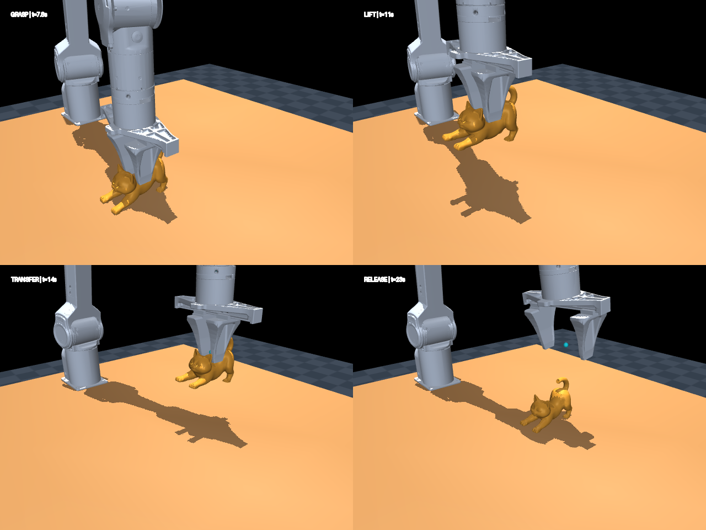

# PiPER H 网格 SDF 抓取与性能测试

默认抓取边长 60 mm、质量 100 g 的方块，执行抬升、横移 15 cm、放下和松爪。网页默认将轨迹缩放为 12 秒，原生命令行保留 24 秒基线。方块来自封闭 OBJ 网格（8 顶点、12 三角形），由 MuJoCo 编译为深度 8 的八叉树 SDF，网页默认再构建稠密缓存；物体碰撞不是解析 box，也没有使用解析 SDF 插件。手指默认使用完整网格 SDF，可切回原盒体作性能对照。

参数页面的“抓取物体”可切换方块/猫手机支架。旧记录缺少此参数时按猫模型回放。内部 `cat_*` 名称保留以兼容已有回放格式。

“抓取物体 → 上传 STL”支持用户上传二进制或 ASCII STL，选择文件坐标单位（默认 mm）和缩放后的最长边（默认 60 mm，填 0 保留原尺寸）。
上传后显示仿真尺寸、三角形数与桌面预览；可选择已有上传物体重复运行。网格保留所有三角形，以 XY 包围盒中心和底面 Z=0 放置，
原 Z 轴方向不旋转，仍使用网格 SDF 碰撞及默认稠密 SDF 查询。质量使用页面“物体质量”，惯量由实际网格计算。
机械臂按物体尺寸估算抓取高度和夹爪开度，沿 X 方向夹取，执行相同搬运阶段；复杂形状的抓取可行性由真实仿真和验收判断，未实现自动抓取点规划。
文件上限 64 MiB / 100 万三角形，要求封闭且面方向一致、无退化面；当前场景支持 X 宽度 ≤85 mm、最长边 ≤150 mm、各轴尺寸 ≥2 mm。
上传资产保存在运行历史目录的 `objects/`，每轮另存独立的 `object.obj` 与尺寸／哈希元数据；历史回放使用本轮网格快照。



[查看搬运动画](grasp_preview.webp)。预览来自旧猫模型及原盒体手指配置，不是当前方块场景。

## 启动

在仓库根目录执行。所需模型已包含在示例中，不依赖旧项目目录或 ROS。

```bash
# 安装运行、测试和网页查看器依赖
uv sync --locked --extra dev

# 默认 Warp GPU 后端，原生 MuJoCo 窗口
uv run python contrib/piper_h/grasp.py

# 原盒体手指对照；方块仍使用八叉树 SDF
uv run python contrib/piper_h/grasp.py --finger-collision=box

# 切回原猫手机支架
uv run python contrib/piper_h/grasp.py --object-shape=cat

# MuJoCo CPU 后端
uv run python contrib/piper_h/grasp.py --engine=c

# 网页查看器，打开终端打印的本地地址
uv run python contrib/piper_h/grasp.py --viewer=viser

# 无界面完整搬运验证，失败时返回非零退出码
uv run python contrib/piper_h/grasp.py --headless --engine=c
uv run python contrib/piper_h/grasp.py --headless --engine=warp
```

一次动作约 24 秒仿真时间，结束后保持最后的控制目标。首次启动需要编译网格八叉树和 Warp 内核，实际播放速度取决于设备和查看器开销。

### 浏览器参数实验页面

在仓库根目录启动页面：

```bash
uv run python contrib/piper_h/grasp_dashboard.py
# 需要局域网其他设备访问时：
uv run python contrib/piper_h/grasp_dashboard.py --host 0.0.0.0
```

默认地址为 `http://127.0.0.1:8765/`。局域网模式下，用本机局域网 IP 替换地址中的 `0.0.0.0`。
终端会打印本次启动的访问令牌；持有令牌的人可以调整参数和启动仿真，只应在可信网络中分享。
如需固定令牌，可在启动命令前设置 `PIPER_H_DASHBOARD_TOKEN` 环境变量。
使用页面期间需保持服务进程运行；未设置固定令牌时，重新启动服务会生成新令牌，需要刷新页面并重新输入。
页面一次只执行一轮仿真，可取消当前运行；完成后保存每个物理步的状态，显示原始物理指标和验收结果，
并可选择两轮运行对照。回放时由 MuJoCo 按需渲染状态：拖动画面旋转视角、按住 Shift 拖动平移、滚轮缩放，
时间轴可定位到任意时刻，回放画面为 16:9，并可选择 640×360 至 1920×1080 分辨率。旧版历史中的状态文件也可直接回放。
新运行还会每约 10 ms 保存一次被抓物体与其他物体的真实接触点和作用在被抓物体上的合力。回放中的“显示作用在物体上的接触力”
可叠加力箭头，并显示当前采样时刻、接触点数和最大单点合力；蓝色代表桌面，橙色代表夹爪，红色代表其他接触。
箭头长度可调，最长显示 20 cm，只表示平移力（法向与切向合力），不表示 `condim=4/6` 中的扭转或滚动力矩。
采样点之间显示最近一次记录的力。旧运行未保存接触力时，页面会提示重新运行；原有状态回放仍可使用。
新运行会显示提交配置、编译模型、生成动作轨迹、运行仿真、验收并保存五个步骤；每步完成后保留实际耗时。
历史默认保存到 `~/.local/share/mujoco_warp/piper_h_runs/`，
也可用 `--data-dir` 指定目录。页面关闭后历史仍保留。

“机器人模式”默认完整机械臂，也可选择“仅夹爪”。仅夹爪默认使用固定末端轨迹，无需完整机械臂参考运行：
直接接近物体、闭合双指、抬升、横移、放下和松爪。轨迹使用平滑的笛卡尔位姿插值，并解析计算线/角速度与加速度，
任务时长随页面配置缩放，夹爪控制遵循所选更新频率；物体、物理参数和批量规模均可调整。仅支持 Warp GPU。

如需公平配对比较，可在“运动轨迹来源”中选择成功的完整臂历史，或从历史点击“以此轨迹运行仅夹爪”。
此时重放每个场景实际记录的末端轨迹，并锁定参考物体、物理参数、时序和场景数；参考导出独立计时和缓存。
两种轨迹来源都保留动态双指和自由物体，由零自由度根体驱动。每轮保存自己的根体轨迹，均支持历史回放。
缺少逐场景状态或速度的旧记录不能作为配对参考，但不影响直接运行固定轨迹；旧记录仍解释为完整臂。
这没有引入 Physim 软垫模型；配对验证与历史性能数据见 [仅夹爪技术对比](GRIPPER_ONLY_COMPARISON.md)。
下列脚本保持使用实际完整臂轨迹配对基准：

```bash
MUJOCO_GL=egl uv run python contrib/piper_h/gripper_only_benchmark.py --worlds 1 128 512 1024 --repeats 3 --profile
```

页面开放物体质量、物体与桌面的滑动/扭转/滚动摩擦、接触维数（`condim`，可选 1 / 3 / 4 / 6，默认 6）、接触时间常数、机械臂与夹爪增益和力限制、关节阻尼、重力补偿、
SDF 深度与查询、物理步长、求解迭代、接触容量和验收阈值；CPU 与 Warp 均可选。
“步进与任务”开放物理步长、控制目标更新频率和任务时长，网页默认分别为 **0.5 ms、2000 Hz、12 秒**。
页面显示实际物理频率、控制频率、控制间隔步数和总物理步数；更新频率按整数物理步间隔取整，最高为物理频率。
两次更新之间保持上一次控制目标，关节位置执行器仍在每个物理步求解。任务时长按完整物理步取整，
原 24 秒轨迹的各阶段同比例缩放；进度、验收阶段窗口和回放时间轴均采用本轮实际时长。
“SDF 查询方式”默认选择 **稠密 SDF**，Warp 在步进前构建 257³ 的 cell 梯度缓存；默认方块与双指共享约 3.01 GiB 额外显存。
可切换八叉树 SDF 作对照；CPU 自动使用八叉树。历史缺少新字段时仍按原步长、逐步更新、24 秒和八叉树解释。
“手指碰撞模型”可选择 SDF 或原盒体近似，默认 SDF；所选模型随本轮配置保存。旧历史记录缺少该字段时按盒体解释。
选择 Warp GPU 后，可在“批量仿真”中选择 **1 / 16 / 32 / 64 / 128 / 256 / 512 / 1024** 个并行场景，默认 1。
这些场景具有相同的参数、初始状态和本轮配置的动作轨迹，各自独立求解；GPU 在同一批次内同时推进全部场景。
MuJoCo CPU 仅支持单场景，切换到 CPU 时场景数自动恢复为 1。
每轮批量运行会验收所有场景，显示通过数量、通过率、逐场景结果、仿真耗时和总场景步吞吐；全部场景通过才判定整批通过。
吞吐包含本轮 Warp 初始化、内核准备、状态记录与下载，不能直接当作纯物理内核性能。
完成的运行历史另显示步进耗时、10 Hz 环境步／秒、累计全部场景的物理步／秒、单场景实时倍数、
批次物理步平均耗时及整轮总耗时。新记录的步进计时在 CPU 循环或 GPU graph 推进前开始，GPU 两端同步；
包含控制、状态／接触力采样和进度更新，不含模型编译、稠密缓存构建、上传、graph 捕获及结果下载，类似 Physim 的推进计时范围。
环境步按完整的 0.1 秒仿真区间折算，与目标更新频率无关；吞吐累计全部场景，不等同于单批次每秒调用数。
旧记录未保存独立步进耗时，历史会明确使用原有含准备和下载的仿真阶段耗时，保持真实的已执行步数（包括原生基线的终点步）。
历史记录保存场景数、所有场景的验收指标，以及每个场景在每个物理步的完整状态轨迹。
展开“逐场景验收结果”，点击结果行或“回看”按钮，即可切换该场景的动画、接触力和顶部物理指标，无需输入场景编号。
切换场景时保留时间点、视角和分辨率，并暂停播放；按“播放”继续观看。回放按需加载所选场景，内存中每轮最多缓存两个场景。
场景 1 的状态和接触力仍保存到运行目录的 `trace.npz` / `contact_forces.npz`，其他场景分别保存到 `worlds/0002/` 等目录。

批量回放使用最多 8 个线程并行压缩，单场景仍直接保存。所有物理步数据、压缩参数和 NPZ 文件格式保持一致；每份归档通过临时文件和原子替换写入，全部保存成功后才标记任务完成。`metrics.json` 分别记录 `validation_seconds` 和 `save_seconds`，运行历史中的“验收并保存”显示两者合计所在阶段的耗时。[512 场景性能报告](BATCH_512_PROFILE.md) 保留优化前的瓶颈分析与优化后的实测结果。
批量运行每场景每次采样最多记录 64 个接触点的力（单场景最多 256 个）；超过时页面显示未画出的数量，不影响物理求解与完整状态记录。
旧批次只保存了场景 1，其余行显示“未保存轨迹”；需重新运行才能回看全部场景。
接触和约束容量仍按每场景设置；场景数增加会提高显存和内存占用，可根据设备容量选择批量大小。
物体与桌面的接触时间常数默认均为 4 ms；每轮可分别调整。CPU / Warp 的时间常数保护已开启，
实际计算值至少为物理步长的两倍；页面随时间常数和步长输入更新生效值，低于保护下限时给出提醒。
当前页面将 SDF 深度限制为 5–10；更深的八叉树在这台主机上可能耗尽内存并中断服务。
抓取动作的目标、姿态、阶段顺序和开合路径仍采用固定基线，阶段时长按所选任务时长缩放。完整参数背景及暂未开放的设置见
[参数设置总结](configuration_options.html)。验收阈值只改变通过判定，不会改变仿真运动。
`condim=1` 只有法向接触、没有摩擦；`condim=3` 启用滑动摩擦；`condim=4` 再启用扭转摩擦；
`condim=6` 再启用滚动摩擦。页面会随所选维数标注每个摩擦输入当前是否生效。

终端会依次提示模型编译、轨迹生成和播放进度。原生命令行保留 1 ms 物理步与 24 秒基线，在前 1 秒仿真时间让物体落稳，之后机械臂开始接近。原生窗口将多个物理步合并到一次画面刷新，目标刷新率约 60 Hz；算力不足时播放仍会慢于实时，可根据终端的仿真时间判断是否在推进。

原生窗口中，空格暂停/继续，句号单步。关闭窗口或在终端按 Ctrl+C 退出；网页模式需要在终端按 Ctrl+C 停止服务，关闭标签页不会停止仿真。重新执行命令可重新播放，查看器的 Reset 不会重置轨迹回放游标。回放期间自动目标会覆盖手动控制。

请通过 `grasp.py` 启动：脚本配置八叉树深度与机器人重力补偿，补全物体初始自由关节状态，再将临时 MJB 和 NPZ 控制轨迹传给仓库现有查看器，退出后清理临时文件。直接打开 XML 不包含这些运行配置。

## 文件说明

| 文件 | 用途 |
| --- | --- |
| `grasp.py` | 唯一演示入口：模型配置、IK、控制轨迹、CPU 验证及查看器启动 |
| `grasp_warp.py` | Warp GPU 仿真与接触记录 |
| `finger_collision_benchmark.py` | SDF / 盒体手指的完整轨迹与固定姿态碰撞效率对照 |
| `grasp_viewer.py` | 复用现有查看器，为原生窗口分离物理步进和画面刷新 |
| `grasp_config.py` / `grasp_dashboard.py` / `grasp_dashboard.html` | 参数校验、局域网运行服务和实验页面 |
| `grasp_scene.xml` | 桌子、地面、灯光、相机和方块 SDF 物体 |
| `piper_h.xml` | 六轴机械臂、夹爪、位置执行器及初始关键帧 |
| `meshes/` | 机械臂和夹爪 STL、方块 OBJ、猫猫完整 OBJ |
| `prepare_cat.py` / `cat_provenance.json` | 猫模型转换脚本、来源、坐标换算与哈希 |
| `grasp_test.py` / `grasp_viewer_test.py` | 资产、模型、完整搬运及原生播放节奏、暂停和单步测试 |
| `grasp_preview.png` / `grasp_preview.webp` | 抓取预览和动画 |
| `piper_h*.urdf`、`provenance.json`、`gripper_provenance.json` | 原始参考模型及机械臂、夹爪来源记录，不作为运行入口 |
| `LICENSE.agx_arm_urdf` | 机械臂及夹爪上游 MIT 许可证 |

## 场景与控制

坐标 Z 向上，长度单位为米，角度单位为弧度。

| 参数 | 默认设置 |
| --- | --- |
| 桌面长 × 宽 / 高度 / 厚度 | 1.2 × 0.8 / 0.75 / 0.04 m，四条固定桌腿 |
| 固定机械臂基座 | `(-0.50, 0, 0.75)`，朝向 +X |
| 初始六轴关节角 / 夹爪开度 | `[0, 90, -90, 0, 0, 0]°` / 0.08 m |
| 方块尺寸 / 网格 | 60 × 60 × 60 mm / 8 顶点、12 三角形 |
| 可选猫模型尺寸 | 约 46.38 × 102.80 × 76.63 mm，保留原始 Z 向上姿态 |
| 物体质量 / 滑动摩擦 | 0.1 kg / 0.8，可在 `grasp_scene.xml` 调整 |
| 初始水平包围盒中心 / 最低点 Z | `(-0.16, -0.075)` / `0.7505` m |
| 搬运目标中心 XY | `(-0.16, 0.075)` m |
| 方块抓取 TCP / 抬升目标 Z | `0.775` / `0.885` m；猫模型为 `0.79` / `0.89` m |
| 自由度 / 执行器数 | 14 / 7：六轴、两个手指、物体六维自由运动；夹爪共用一个执行器 |
| 积分器 / 步长 | implicitfast / 网页 0.0005 秒；原生基线 0.001 秒 |

动作依次为落稳、接近、下降、夹紧、抬升、横移、下降、释放、退回。机械臂使用有界阻尼最小二乘 IK 和五次平滑插值，双指沿物体较窄的 X 方向合拢。运行中只写执行器目标，不使用焊接、吸附或逐帧修改物体位姿。

夹爪的 `gripper_opening` 表示标称开度，范围 0–0.1 m；两个滑动关节通过等式约束保持正负半开度，由一个固定腱位置执行器驱动。夹紧目标为零，由物体接触阻止继续闭合。TCP 相对 `link6` 的位置为 `(0, 0, 0.130)`。

| 控制参数 | 设置 |
| --- | --- |
| 六轴 Kp | 80, 140, 120, 35, 22, 12 |
| 六轴 Kv | 5, 8, 7, 2.5, 1.8, 1.2 |
| 六轴力矩上限（N·m） | 30, 30, 24, 12, 10, 8 |
| 六轴阻尼 / 摩擦损失 / armature | 各轴 0.12 / 0.04 / 0.005 |
| 夹爪 Kp / Kv / 力限制 | 400 / 4 / ±10 N |
| 手指阻尼 / 摩擦损失 / armature | 0.1 / 0 / 0.001 |
| 重力补偿 | 仅机械臂和夹爪启用，物体仍完整承受重力 |

这是搬运演示，未实现精确放置的反馈控制。完整验收要求位置误差不超过 **5 cm**、携带阶段物体最低点离桌面至少 8 cm，并持续存在双指接触。碰撞几何、控制增益、质量、摩擦和放置角度补偿均为仿真默认值，不代表真机标定参数。旧猫模型的原盒体配置已存在放置后稳定性验收失败；猫模型换成 SDF 手指后，真实手指凹槽会改变夹持接触，原轨迹还可能在搬运中滑落。保留原验收阈值，性能计时不代表抓取验收通过。

## SDF 与资产准备

所选物体和两根手指的碰撞几何为原生 `type="sdf"`，由 MuJoCo 编译网格八叉树。手指直接使用现有 `gripper_link1.stl` / `gripper_link2.stl` 的完整网格，保留原局部坐标、质量和惯量。脚本对全部 SDF 网格统一设置 `octree_maxdepth=8`，场景使用 `sdf_initpoints=40`、`sdf_iterations=10`；所有几何体默认使用 `condim=6`，页面每轮运行可统一改为 1 / 3 / 4 / 6。SDF 手指与物体采用 SDF–SDF 接触，桌面盒体与物体采用 box–SDF 接触。

为兼容网页查看器，物体外观使用同一个完整网格的独立 `mesh` 几何，质量为零且关闭碰撞；透明的 SDF 几何承担物体质量和全部接触求解。手指同样保留独立的无碰撞视觉网格，其质量和惯量由原显式 `inertial` 指定。机械臂本体使用圆柱、胶囊近似，夹爪基座使用盒体。选择 `finger_collision=box` 时，脚本将每根手指替换回原来的根部和指尖两个盒体。

两根手指各有 2,086 个三角面。源 STL 包含重合接缝和部分多面共享边，未在此修改资产；CPU/Warp 球形探针覆盖手指表面、中央凹槽和外部空域，但不构成对整个网格距离场的误差保证。

### 旧猫模型的手指 SDF / 盒体效率对照

```bash
uv run python contrib/piper_h/finger_collision_benchmark.py --object-shape=cat --worlds 1 16 64 256 --repeats 3 --output contrib/piper_h/results/finger_collision/comparison.json
```

完整轨迹测试使用相同的控制输入、步长、质量、惯量、摩擦和容量，交替测试两种手指几何，每组重复三次取中位数。
计时包含控制更新、GPU 物理步和图提交，排除模型编译、上传、预热及回放记录；编译耗时单独记录。
另外从盒体运行保存夹紧与携带阶段的固定姿态，两种几何在相同姿态下重复碰撞查询，以避免滑落导致接触减少影响解释。
原始数据、固定姿态和 Markdown 报告保存在 `results/finger_collision/`，由 Git 忽略，仅保存在本机。

猫模型原 STL 有 468,114 个三角面，超过 MuJoCo 的 STL 读取上限。OBJ 已随示例提供；仅需重新生成时运行：

```bash
uv run python contrib/piper_h/prepare_cat.py \
  --source /home/yangyunchen/Documents/LAN-Share/stl/cat_phone_stand.stl
```

转换合并完全相同的顶点，保留全部三角面、面朝向和连接关系，不做减面或凸分解。毫米坐标乘以 `0.001`，水平包围盒中心平移到原点，最低点移到 Z=0。`cat_provenance.json` 记录源文件路径、转换前后的 SHA-256、坐标换算、尺寸及面数。运行演示不需要原始 STL。

机械臂资产来自旧项目 `Simulation/src/piper_sim/models`，夹爪来自 `PhysicalEngine`；上游均为 AgileX `agx_arm_urdf`，提交 `f6642ce0d7872c686f29c99e9e10cd23d1d49313`。原始 URDF、哈希和 MIT 许可证保留供核对。URDF 中的 ROS package 路径及部分 DAE 引用不用于运行。猫模型来自用户提供的本地文件，其授权不包含在机械臂的 MIT 许可证中。

## 验证

```bash
uv run pytest contrib/piper_h/grasp_test.py contrib/piper_h/grasp_viewer_test.py contrib/piper_h/grasp_dashboard_test.py -q
uv run ruff check contrib/piper_h
uv run ruff format --check contrib/piper_h
uv run python contrib/kernel_analyzer/kernel_analyzer/cli.py contrib/piper_h/grasp_warp.py
```

测试校验机械臂和夹爪资产哈希、桌面和基座位置、关节目标范围、猫模型全部三角面和闭合拓扑、有效八叉树、自由刚体、重力补偿范围及 MJB/NPZ 回放。若原 STL 仍在来源路径，会逐三角形核对转换结果。凹面探针验证真实空隙中没有 SDF 接触，而凸包会错误填充该空隙；表面探针比较 CPU/GPU 的接触距离与法向。

完整 CPU/GPU 搬运验收检查携带高度、双指持续接触、落点、落桌后漂移、有限状态、固定基座、关节和力矩限制及非预期桌面接触。没有 CUDA 时跳过 GPU 测试，`--headless --engine=warp` 则明确报错。

当前查看器可能在首次 CUDA 图执行前于 `Time = 0.0000` 打印惯量矩阵警告；实际步进已通过 CPU/GPU 验证。Warp 对胶囊—圆柱碰撞对还会提示最多生成一个接触点，该提示不影响猫模型的 SDF 接触。

本示例不注册到默认 benchmark，也不修改公共查看器或物理引擎接口。

### 本地性能结果

`parallel_efficiency_benchmark.py` 保留在 Git 中。性能测量生成的报告、CSV 和 JSON 统一放在
`results/parallel_efficiency/`，整个 `results/` 目录由 Git 忽略，仅保存在本机。
现有报告为该目录中的 `parallel_efficiency_report.html`。

```bash
uv run python contrib/piper_h/parallel_efficiency_benchmark.py
```

默认输出为 `results/parallel_efficiency/benchmark_results.json`（相对于本示例目录），目录会自动创建。
可使用 `--output` 指定其他文件名，保留不同轮次的测量结果。

## 方块性能对比

```bash
uv run python contrib/piper_h/finger_collision_benchmark.py --object-shape=cube --worlds 1 16 64 256 --repeats 3 --output contrib/piper_h/results/cube_sdf/comparison.json
```

同一方块、同一控制轨迹、相同接触与求解器参数，只切换手指碰撞。每组运行完整 24 秒轨迹三次，报告中位数及原始数据；另在同一保存姿态测纯碰撞查询。模型编译、GPU 上传、预热和回放记录排除在仿真计时之外。抓取验收单独运行，避免物体掉落减少接触计算量却被误判成性能提升。结果保存于 `results/cube_sdf/`，此前猫模型结果保留于 `results/finger_collision/`。

## 单环境 GPU 分项耗时

```bash
uv run python contrib/piper_h/finger_cost_profile.py --repeats 3 --stride 20
```

在原 CUDA Graph 内采样碰撞、约束构建、求解、动力学和积分时间，每 20 步采样一次；另跑仅标记物理步起止的对照估计计时影响。各版本使用总 GPU 耗时中位数对应的完整一轮计算分项占比，同时保留全部重复数据。占比分母是 GPU 物理步，不含 CPU 提交、编译或回放；嵌套的 SDF 窄相是碰撞子项，不重复计入。原始采样、汇总 JSON 与报告默认保存到 `results/cube_cost_profile/profile.*`。

### 碰撞内部：粗筛与精细碰撞

```bash
uv run python contrib/piper_h/collision_cost_profile.py --repeats 3 --stride 20
```

同一单环境抓取轨迹下，对 `nxn_broadphase`、整个 `_narrowphase` 及 `collision` 总时间分别插入 CUDA events；分项占比以碰撞总耗时为分母。另跑只测碰撞总时间的校准组，结果保存在 `results/cube_collision_profile/profile.*`，包含毫秒/步、占比、各动作阶段和逐轮原始采样。

### 稠密 SDF / 梯度缓存实验

可以把两个手指及方块的原生八叉树预采样为共享的稠密距离＋梯度网格，通过直接索引和三线性插值加速碰撞查询。实验入口、精度限制、显存开销和复现命令见 [DENSE_SDF.md](DENSE_SDF.md)。网页默认启用稠密 SDF，可切回八叉树；原生命令行保持八叉树基线，实验通过 `attach_dense_sdf` 显式启用。

盒体手指／全部八叉树／全部稠密三版本的统一轮换测量使用 `three_way_benchmark.py`，覆盖 1 和 512 环境、完整抓取验收、碰撞分项及固定姿态对照。审查修复记录和复测结果见 [REVIEW_20260929.md](REVIEW_20260929.md)。

### 与 Physim 软指腹仿真对照

[技术对比文档](PHYSIM_COMPARISON.md) 比较当前整臂仿真与上一级 `physim/grasp-lab` 的局部软指腹模型，并给出统一 0.5 ms 物理步、2000 Hz 目标更新、200 步 CUDA graph、12 秒任务的耗时结果。

[256–1024 场景效率对比](DENSE_PHYSIM_SCALING.md) 补充完整机械臂方块／双指稠密 SDF 与 Physim 的三次中位数、吞吐扩展和任务完整性检查；基准脚本可通过 `--modes mujoco_dense physim_region` 选择这两套实现。
该对照使用相同方块、质量、运行环境与批量大小；整臂动力学、材料形变、接触定律和任务轨迹的差异在文档中分别说明。
当前 24 秒轨迹压缩到 12 秒后另做完整抓取验收。Physim 原始目录保持不变，运行副本和原始数据保存到被 Git 忽略的 `results/physim_comparison/`。

```sh
uv run --no-project --python ../physim/.venv/bin/python python contrib/piper_h/physim_benchmark.py \
  --worlds 1 128 512 --repeats 3 --output contrib/piper_h/results/physim_comparison
```
